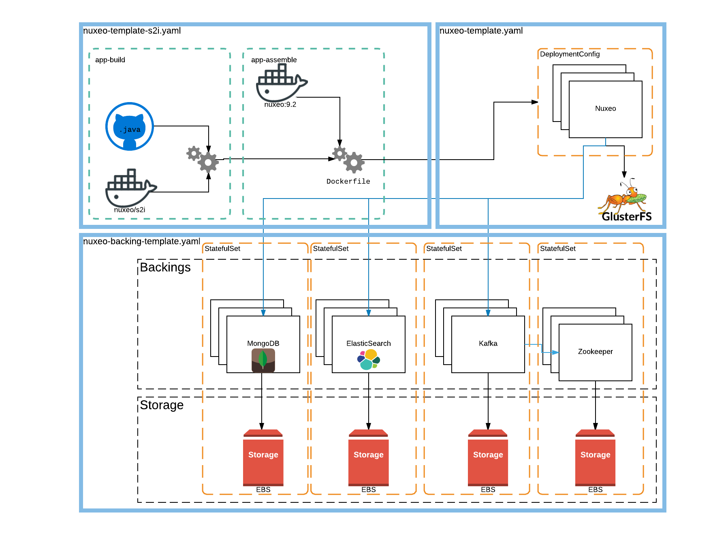
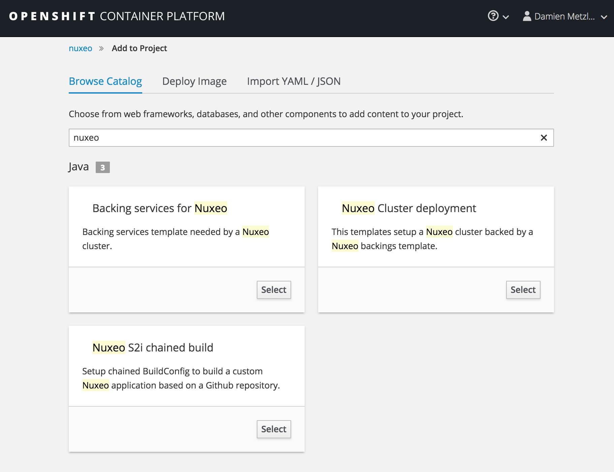

# Nuxeo on OpenShift and AWS

## Deprecated
This legacy branch holds the former script that used to hold several definitions and templates for k8s services in order to run a Nuxeo Cluster on top of OpenShift. However we do not maintain those in favor of [Nuxeo APB Catalog](https://github.com/nuxeo/nuxeo-apb-catalog) and [Nuxeo development template](https://github.com/nuxeo/nuxeo-openshift)

## Prerequisite
In order to run it, you need a [configured OpenShift cluster on AWS](https://github.com/openshift/openshift-ansible-contrib/tree/master/reference-architecture/aws-ansible) with a CNS stack deployed on it as Nuxeo uses the GlusterFS storage to store binaries.

## How to run

### Deploy global resources in Openshift
First we create an EBS storage definition that will be used by our resources.

    # oc create -f aws-storage-class.yaml
    storageclass "aws-fast" created

After that, we have to deploy a custom Security Context Constraint that will be needed by our Elasticsearch pods.

    # oc create -f es-scc.yaml
    securitycontextconstraints "es-scc" created

And finally we have to deploy our three templates to the `openshift` namespace :

    # oc create -f nuxeo-backing-template.yaml -n openshift
    template "nuxeo-backings"
    # oc create -f nuxeo-template.yaml -n openshift
    template "nuxeo-template"
    # oc create -f nuxeo-template-s2i.yaml -n openshift
    template "nuxeo-template-s2i"

### Create the nuxeo project

Our pods will be deployed in a dedicated environment/project so we will create it :

    # oc new-project nuxeo
    Now using project "nuxeo" on server "https://....:443".

    You can add applications to this project with the 'new-app' command. For example, try:

        oc new-app centos/ruby-22-centos7~https://github.com/openshift/ruby-ex.git

    to build a new example application in Ruby.

Now we have to configure the security for Elasticsearch by first creating a dedicated `serviceAccount` and then applying some rules on it.

    # oc create sa elasticsearch
    serviceaccount "elasticsearch" created
    # oc adm policy add-scc-to-user es-scc system:serviceaccount:nuxeo:elasticsearch
    # oc adm policy add-role-to-user view system:serviceaccount:nuxeo:elasticsearch

Pay attention to the fact that the service account name container the name of the project. So if you use another project, you'll have to create another `serviceAccount` and change the `nuxeo` part in the user name.

### Deploy our stack

We will use three different templates to deploy our stack. The following schema describe what will be deployed and which template takes care of what :

In Openshift, click on *Add to project -> Browse Catalog* and filter the template with nuxeo :

First start the **Backing Services for Nuxeo** stack that will start lots of pod. Ensure that all services are up and running before launching the second template : **Nuxeo Cluster Deployment**. Once you Nuxeo cluster is deployed, you can launch the **Nuxeo S2i chained build** that will create a build based on a Github project and update the `ImageStream` on which the Nuxeo deployment is based.

There we are, the `DeploymentConfig` should start a new rolling upgrade and your project be deployed.

# Licensing

Most of the source code in the Nuxeo Platform is copyright Nuxeo and
contributors, and licensed under the Apache License, Version 2.0.

See [/licenses](/licenses) and the documentation page [Licenses](http://doc.nuxeo.com/x/gIK7) for details.

# About Nuxeo

Nuxeo dramatically improves how content-based applications are built, managed and deployed, making customers more agile, innovative and successful. Nuxeo provides a next generation, enterprise ready platform for building traditional and cutting-edge content oriented applications. Combining a powerful application development environment with SaaS-based tools and a modular architecture, the Nuxeo Platform and Products provide clear business value to some of the most recognizable brands including Verizon, Electronic Arts, Sharp, FICO, the U.S. Navy, and Boeing. Nuxeo is headquartered in New York and Paris. More information is available at [www.nuxeo.com](http://www.nuxeo.com).

